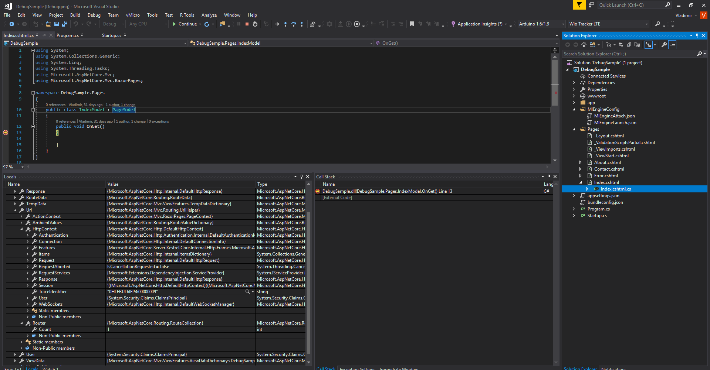

# DockerDotnetDebug
A remotely debuggable docker container, use it as your base runtime in desperate times, when you need to debug somehting remotely and you just can;t do all the tests locally. 


# Quickstart

1. `docker run -d -p 2222:2222 -p 5000:5000 clumsypilot/dotnetdebug:asp-debug-sample`
2. Open `Localhost:5000` and verify thee website is running. 
3. Clone the Repo and open project DotnetDebug in VS2017
4. Setup a remote connection over SSH
5. Set a breakpoint in `DebugSample/Pages/Index.cshtml.cs`
6. Start debugger and reload page! 



Alternatively, debug this container while it's running on a kubernetes cluster using 
```
kubectl port-forward <POD-NAME> 2222
```
For details, read my blogpost: 
https://blog.quickbird.uk/debug-netcore-containers-remotely-9a103060b2ff

# Main Files
* **DebugSample** - a sample Asp.Net Core 2.0 applicaitonconfigured for debugging. It will serve a static page on `localhost:5000`
* **DebugASP.Dockerfile** - a dockerfile that builds a container with the asp applicaiton
* **Diagram.xml** - Draw.io diagram to illustrate how debugging .Net Core applications works
* **DotnetDebug.Dockerfile** - a dockerfile for buildings a debuggable base container for .Net Core applications. Used as base in **DebugASP.Dockerfile*
* **StartSSHAndApp.sh** - a script that starts two processes in **Docker**, the **OpenSSH** server and a **.Net Core** application
* **authorized_keys** - keys authorised for connection to the **OpenSSH** server, config file that must be copied to `root/.ssh/authorized_keys` into the container. 
* **privateKey.openssh** and **privateKey.ppk** - OpenSSH Keys for **Putty**, corresponding to the **authorized_keys*
* **sshd_config** - a configuration file for OpenSSH server, that must be copied to `/etc/ssh/sshd_config`
* **DebugSample/MIEngineConfig/MIEngineAttach.json** - A configuration file for **MiEngine**, used in **Visual Studio 2017** to attach to a docker container for debugging.
* **DebugSample/.vscode/launch.json** - A configuration file for **Visual Studio Code** with an **Omnisharp Plugin** to attach to a remote docker container for debugging
* **DebugSample/Pages/Index.cshtml.cs** - set a breakpoint here on `public void OnGet()` and refresh the index page. 
